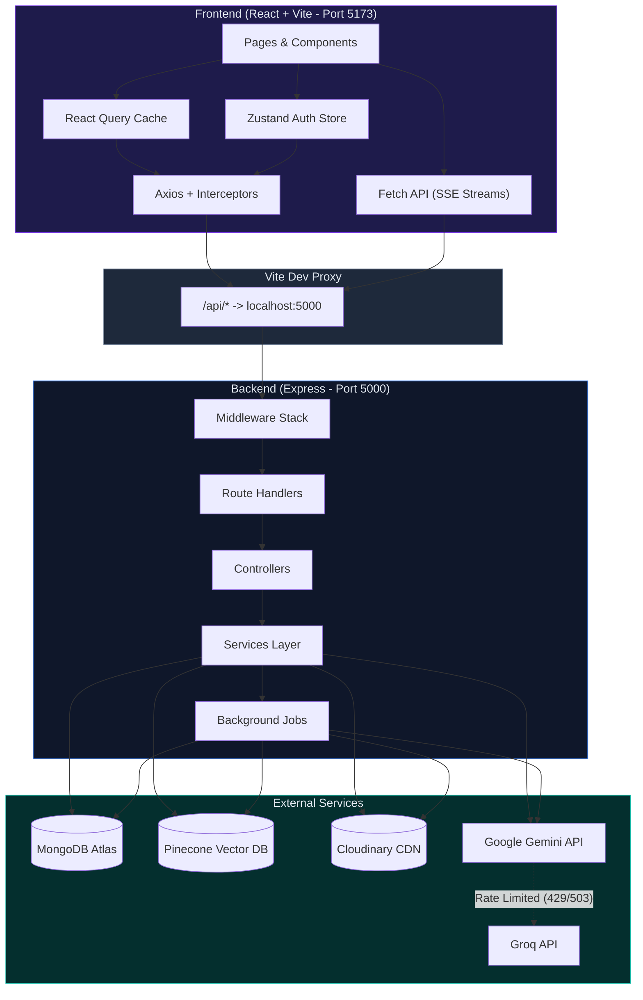
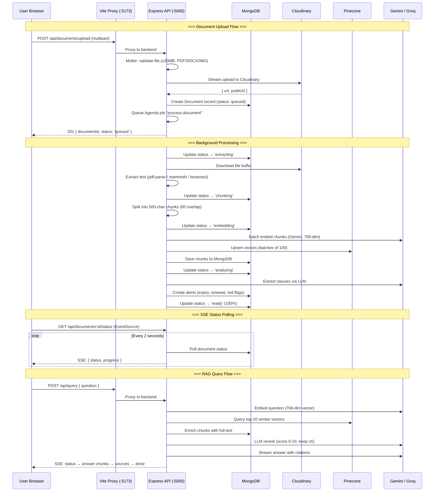
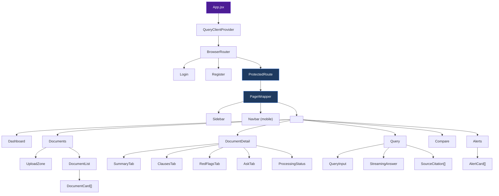
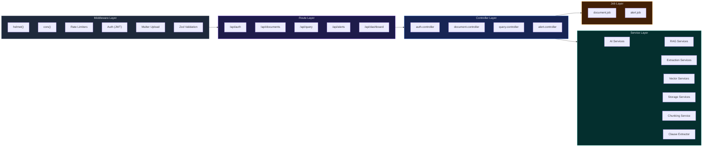
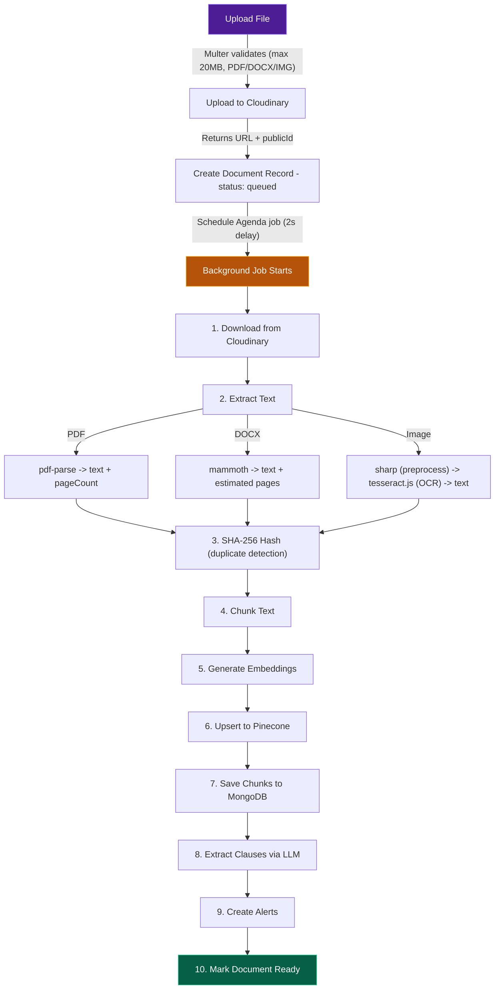
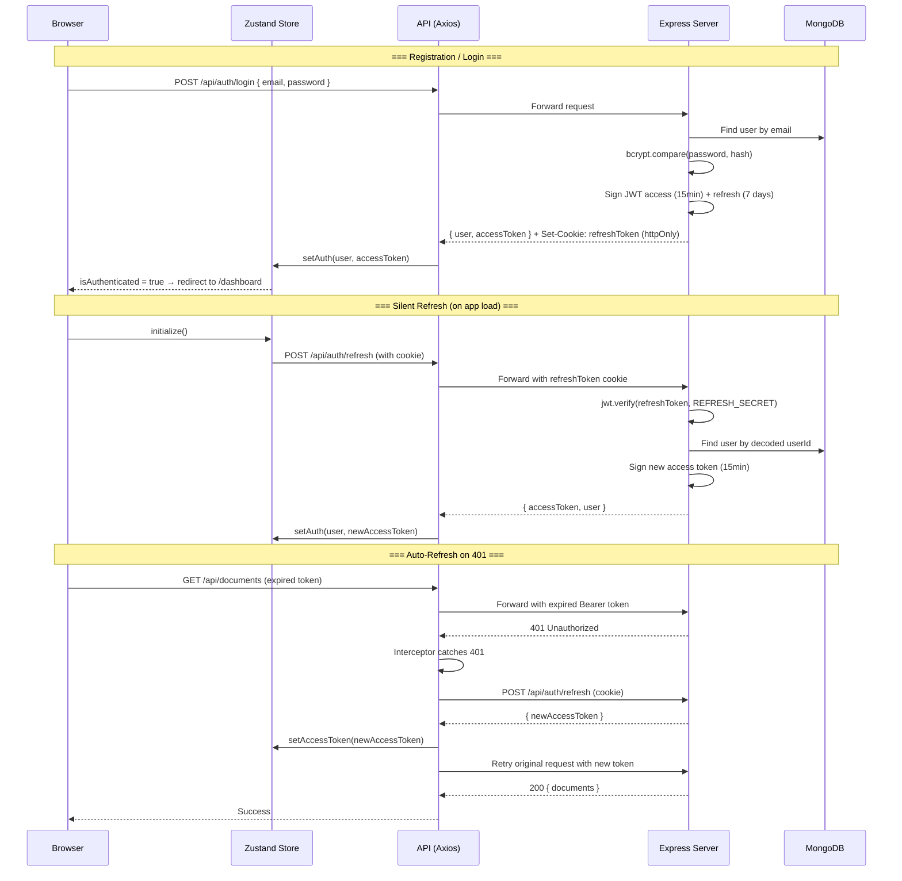
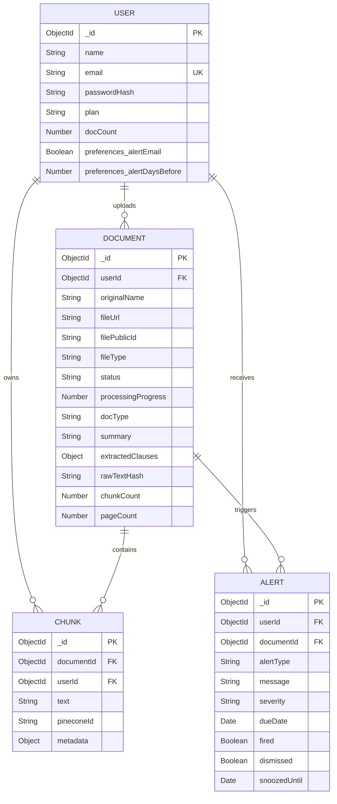

<p align="center">
  
  
  
  
  
  
</p>

# 📜 What Did I Sign?

> **RAG-Powered Personal Agreement Vault** — Upload, analyze, and intelligently query your contracts and legal documents using AI.

**What Did I Sign?** is a full-stack AI application that lets you upload legal documents (contracts, offer letters, insurance policies, NDAs, lease agreements), automatically extracts and analyzes their contents, stores them as vector embeddings, and lets you ask natural language questions about them — with cited sources.

---

## 📑 Table of Contents

- [Features](#-features)
- [Tech Stack](#-tech-stack)
- [System Architecture](#-system-architecture)
- [Frontend Architecture](#-frontend-architecture)
- [Backend Architecture](#-backend-architecture)
- [Document Processing Pipeline](#-document-processing-pipeline)
- [RAG Query Pipeline](#-rag-query-pipeline)
- [Authentication Flow](#-authentication-flow)
- [Database Models](#-database-models)
- [API Reference](#-api-reference)
- [Project Structure](#-project-structure)
- [Getting Started](#-getting-started)
- [Environment Variables](#-environment-variables)
- [Key Design Decisions](#-key-design-decisions)

---

## ✨ Features

| Feature | Description |
|---------|-------------|
| 📤 **Document Upload** | Drag-and-drop upload for PDF, DOCX, and scanned images (JPEG/PNG/WebP) |
| 🔍 **Text Extraction** | Automatic text extraction via pdf-parse, mammoth (DOCX), or Tesseract.js OCR |
| 🧠 **AI Analysis** | LLM-powered clause extraction — parties, dates, penalties, red flags, financial terms |
| 📊 **Vector Embeddings** | Documents are chunked, embedded (768-dim), and stored in Pinecone for semantic search |
| 💬 **Natural Language Queries** | Ask questions in plain English — AI searches your docs and streams cited answers |
| ⚖️ **Document Comparison** | Compare two agreements side-by-side on any topic |
| 🚨 **Smart Alerts** | Automatic alerts for expiry dates, renewal deadlines, and red flags |
| 🔐 **Secure Auth** | JWT access tokens + httpOnly refresh cookies with automatic silent refresh |
| 🌊 **Real-time Streaming** | SSE-based streaming for both processing status and AI answers |
| 🎨 **Premium Dark UI** | Glassmorphism design with gradient accents, micro-animations, and responsive layout |

---

## 🛠 Tech Stack

### Frontend
| Technology | Purpose |
|-----------|---------|
| **React 19** | UI framework |
| **Vite 8** | Build tool & dev server with HMR |
| **Tailwind CSS 3** | Utility-first styling + custom glassmorphism design system |
| **TanStack React Query 5** | Server state management, caching, mutations |
| **Zustand 5** | Client state management (auth store) |
| **React Router 7** | Client-side routing |
| **React Hook Form + Zod** | Form management with schema validation |
| **Axios** | HTTP client with interceptors for auth refresh |
| **Lucide React** | Icon library |
| **date-fns** | Date formatting utilities |
| **react-dropzone** | Drag-and-drop file upload |
| **react-hot-toast** | Toast notifications |

### Backend
| Technology | Purpose |
|-----------|---------|
| **Express 4** | REST API framework |
| **MongoDB + Mongoose 8** | Primary database & ODM |
| **Pinecone** | Vector database for semantic search |
| **Cloudinary** | Cloud file storage for uploaded documents |
| **Gemini 2.5 Flash** | Primary LLM for analysis, reranking, and answer generation |
| **Groq (Llama 3.3 70B)** | Fallback LLM when Gemini is rate-limited |
| **Gemini Embedding 001** | Text embedding model (768 dimensions) |
| **Agenda.js** | Background job queue for document processing |
| **pdf-parse** | PDF text extraction |
| **mammoth** | DOCX text extraction |
| **Tesseract.js + Sharp** | OCR for scanned images |
| **node-cron** | Scheduled alert checking |
| **Winston** | Structured logging |

---

## 🏗 System Architecture

### High-Level Overview



### Request Flow



---

## 🖥 Frontend Architecture

### Component Tree



### State Management

| Store | Library | Scope | Persistence |
|-------|---------|-------|-------------|
| **Auth State** | Zustand | `user`, `accessToken`, `isAuthenticated`, `isInitialized` | None (rebuilt via cookie refresh on load) |
| **Server State** | React Query | Documents, Alerts, Dashboard stats | In-memory cache, staleTime: 2 min |

**Auth Store Actions:**
- `setAuth(user, token)` — Login/register success
- `setAccessToken(token)` — Silent refresh
- `logout()` — Clear all auth state
- `initialize()` — Called on app mount, attempts cookie-based token refresh

### Pages Overview

| Page | Route | Key Features |
|------|-------|-------------|
| **Login** | `/login` | Email/password form, Zod validation, ambient blur orbs |
| **Register** | `/register` | Name/email/password/confirm form, password match validation |
| **Dashboard** | `/dashboard` | Animated stat counters, quick query, recent alerts & documents |
| **Documents** | `/documents` | Upload zone toggle, filterable document grid (type + status) |
| **DocumentDetail** | `/documents/:id` | Tabbed view: Summary, Clauses, Red Flags, Ask (per-doc query) |
| **Query** | `/query` | Full RAG query interface with document filters, streaming answer, source citations |
| **Compare** | `/compare` | Select 2 docs + topic, get structured comparison |
| **Alerts** | `/alerts` | Filtered tabs (All/Upcoming/Red Flags/Dismissed), dismiss & snooze actions |

### Design System

The UI uses a custom **glassmorphism design system** built on Tailwind CSS:

| Class | Effect |
|-------|--------|
| `.glass` | `bg-slate-900/50 backdrop-blur-xl border-slate-700/50` — Standard glass panel |
| `.glass-light` | `bg-slate-800/30 backdrop-blur-lg border-slate-700/30` — Lighter variant |
| `.glass-strong` | `bg-slate-900/80 backdrop-blur-2xl border-slate-700/60` — Opaque variant |
| `.gradient-text` | Animated violet → blue → cyan text gradient |
| `.gradient-border` | Pseudo-element gradient border using `mask-composite` |

**Custom animations:** fadeIn, slideUp, slideDown, scaleIn, pulse, shimmer (skeleton loading), float

**Font:** Inter (Google Fonts, weights 300–900)

**Color palette:** Slate-950 background, violet/blue/cyan accents, severity-coded alerts (blue/amber/rose)

---

## ⚙️ Backend Architecture

### Layered Architecture



### Middleware Stack (in order)

| # | Middleware | Purpose |
|---|-----------|---------|
| 1 | `helmet()` | Security headers (CSP, XSS protection, etc.) |
| 2 | `cors()` | Allow frontend origin with credentials |
| 3 | `express.json()` | Parse JSON bodies (1MB limit) |
| 4 | `cookieParser()` | Parse httpOnly cookies for refresh tokens |
| 5 | `morgan('dev')` | HTTP request logging via Winston |
| 6 | `generalLimiter` | Rate limit: 100 requests / 15 min on all `/api` |
| 7 | `protect` | JWT verification (per-route, from header or query param) |
| 8 | `upload.single('file')` | Multer file upload (per-route, 20MB, memory storage) |
| 9 | `validate(schema)` | Zod body validation (per-route) |

### Rate Limiting

| Limiter | Scope | Limit | Window |
|---------|-------|-------|--------|
| `generalLimiter` | All `/api` routes | 100 requests | 15 minutes |
| `authLimiter` | `/api/auth/register`, `/api/auth/login` | 20 requests | 15 minutes |
| `queryLimiter` | `/api/query`, `/api/query/compare` | 10 requests | 1 minute |

### Services Map

```
server/src/services/
├── ai/
│   ├── embedding.service.js    # Gemini embedding-001 (768-dim, batch 50)
│   └── llm.provider.js         # Gemini 2.5 Flash → Groq Llama 3.3 fallback
├── chunking/
│   └── chunker.service.js      # Recursive text splitter (500 chars, 60 overlap)
├── clause/
│   └── clause.extractor.js     # LLM-based clause/red flag extraction
├── extraction/
│   ├── pdf.extractor.js        # pdf-parse
│   ├── docx.extractor.js       # mammoth
│   └── ocr.extractor.js        # sharp → tesseract.js
├── rag/
│   ├── retriever.service.js    # Pinecone query + MongoDB enrichment
│   ├── reranker.service.js     # LLM-based relevance scoring (0-10)
│   ├── answerer.service.js     # Streaming answer with citations
│   └── comparator.service.js   # Side-by-side document comparison
├── storage/
│   └── cloudinary.service.js   # Upload/delete files on Cloudinary
└── vector/
    └── pinecone.service.js     # Upsert/query/delete vectors
```

---

## 📄 Document Processing Pipeline

When a user uploads a document, it goes through a **10-step background pipeline** managed by Agenda.js:



### Step-by-Step Detail

| Step | Status | Progress | What Happens |
|------|--------|----------|-------------|
| **1. Download** | `extracting` | 5% → 15% | Fetches the uploaded file from Cloudinary URL into a Buffer |
| **2. Extract Text** | `extracting` | 15% → 30% | Routes to the correct extractor based on file type: **PDF** → `pdf-parse` extracts text + page count. **DOCX** → `mammoth.extractRawText()`, estimates pages as `ceil(length / 3000)`. **Image** → `sharp` preprocesses (grayscale, sharpen, normalize → PNG), then `tesseract.js` OCR (English) |
| **3. Hash** | `extracting` | 30% | Computes SHA-256 of raw text, stores as `rawTextHash` for deduplication |
| **4. Chunk** | `chunking` | 40% → 50% | Splits cleaned text using a recursive character text splitter with **legal-aware separators**: `\n\n\n`, `\n\n`, `\nClause `, `\nSection `, `\nArticle `, `\nSchedule `, `\n`, `. `, ` `, `""`. **Chunk size: 500 chars, overlap: 60 chars**. Each chunk gets a `chunkIndex` and estimated `pageNumber` |
| **5. Embed** | `embedding` | 55% → 70% | Sends chunk texts to **Gemini embedding-001** in batches of 50. Each text → 768-dimensional vector. Uses `model.batchEmbedContents()` |
| **6. Upsert Vectors** | `embedding` | 70% → 75% | Upserts to Pinecone in batches of 100. Vector ID: `{documentId}-{chunkIndex}`. Metadata: `userId`, `documentId`, `docType`, `docName`, `pageNumber`, `chunkIndex`, `text` (first 1000 chars) |
| **7. Save Chunks** | `embedding` | 75% → 80% | Bulk inserts Chunk documents to MongoDB with `documentId`, `userId`, `text`, `pineconeId`, `metadata` |
| **8. Clause Extraction** | `analyzing` | 80% → 90% | Sends text to LLM (Gemini → Groq fallback) with a legal parser prompt. Extracts: `parties`, `startDate`, `endDate`, `noticePeriod`, `penaltyClauses`, `autoRenewal`, `depositAmount`, `monthlyAmount`, `redFlags` (with severity), `keyDates`, `docType`, `summary`. Text truncated to first 6000 + last 2000 chars for long documents |
| **9. Create Alerts** | `analyzing` | 90% | Generates alerts based on extracted clauses: **Expiry** alert if `endDate` exists, **Renewal** alert if `autoRenewal && endDate` (30 days before), **Notice Deadline** alert if `noticePeriod && endDate` (notice days before), **Red Flag** alerts for each high-severity red flag |
| **10. Mark Ready** | `ready` | 100% | Updates document with analysis results, sets `processedAt`, increments user `docCount` |

### Text Cleaning (Pre-Chunking)

The raw extracted text is cleaned before chunking:
1. Form feed characters (`\f`) → newlines
2. Trailing whitespace on each line → trimmed
3. 4+ consecutive blank lines → collapsed to 3
4. Multiple spaces → single space

---

## 🔍 RAG Query Pipeline

When a user asks a question, the app executes a **4-stage Retrieval-Augmented Generation pipeline**:


### Stage 1: Embed Query
- **Model:** Gemini `embedding-001`
- **Dimensions:** 768
- The user's question is converted into a dense vector representation
- Same model used for document chunks ensures alignment in vector space

### Stage 2: Retrieve Relevant Chunks
- **Database:** Pinecone
- **Top-K:** 10 vectors
- **Filters:** Always filtered by `userId` (data isolation). Optional: `documentId` (single-doc query), `docType` (category filter)
- After Pinecone returns matches with metadata, chunks are **enriched** from MongoDB to get full text (Pinecone metadata stores only first 1000 chars)
- Returns: `[{ id, score, text, metadata: { docName, pageNumber, documentId, ... } }]`

### Stage 3: Rerank with LLM
- **Method:** LLM-based reranking (no external reranking API needed)
- Sends all 10 chunks with their document names and page numbers to the LLM
- LLM scores each chunk 0–10 for relevance to the query
- **Filters:** Keep only chunks with score ≥ 5
- **Limit:** Top 5 highest-scoring chunks
- **Fallback:** If LLM reranking fails (rate limit, parse error), returns original Pinecone order (top 5)

### Stage 4: Stream Answer
- **Primary LLM:** Gemini 2.5 Flash (temperature: 0.3)
- **Fallback LLM:** Groq Llama 3.3 70B (automatic on 429/503 errors)
- Context is built from reranked chunks with labels: `[Document: name | Page: N]`
- **System prompt rules:**
  - Answer using ONLY the provided document excerpts
  - Cite document names for every claim
  - Never invent or assume clauses not in the text
  - Highlight potential red flags
  - If information isn't in the documents, say so explicitly
- Response is **streamed** via SSE (Server-Sent Events) for real-time display

### SSE Event Protocol

The query endpoint uses named SSE events:

```
event: status
data: {"step":"embedding","message":"Understanding your question..."}

event: status
data: {"step":"retrieving","message":"Searching your documents..."}

event: status
data: {"step":"analyzing","message":"Analyzing relevance..."}

event: status
data: {"step":"generating","message":"Generating answer..."}

event: answer
data: {"text":"Based on your offer letter, "}

event: answer
data: {"text":"your monthly in-hand salary is..."}

event: sources
data: {"sources":[{"documentName":"Offer_Letter.docx","documentId":"...","page":2,"relevance":0.95,"excerpt":"...first 200 chars..."}]}

event: done
data: {"chunksUsed":3}
```

### Document Comparison Pipeline


---

## 🔐 Authentication Flow



**Key details:**
- **Access token** (15 min): Stored in Zustand memory only — never in localStorage
- **Refresh token** (7 days): Stored as `httpOnly`, `sameSite: Lax`, `path: /` cookie — not accessible to JavaScript
- **Query endpoint auth**: The query service uses raw `fetch()` (for SSE streaming). On 401, it independently calls `/api/auth/refresh` before retrying
- **SSE endpoint auth**: `EventSource` API cannot set headers, so the token is passed as `?token=` query parameter. The auth middleware reads from both `Authorization` header and `req.query.token`

---

## 🗃 Database Models

### Entity Relationship Diagram



### extractedClauses Schema (Document subdocument)

```javascript
{
  parties:        [String],           // ["Aniket Bajpai", "Anthropic Inc."]
  startDate:      Date,               // 2026-07-01
  endDate:        Date,               // 2027-06-30
  noticePeriod:   String,             // "30 days"
  penaltyClauses: [String],           // ["Early termination fee of $5,000"]
  autoRenewal:    Boolean,            // false
  depositAmount:  String,             // "$2,000"
  monthlyAmount:  String,             // "$15,000"
  redFlags: [{
    clause:       String,             // "Non-compete extends 2 years post-employment"
    severity:     "low"|"medium"|"high",
    explanation:  String              // "This is unusually long and may limit..."
  }],
  keyDates: [{
    label:        String,             // "Probation End Date"
    date:         Date                // 2026-10-01
  }]
}
```

---

## 📡 API Reference

All endpoints return responses in a consistent shape:
```json
{
  "success": true | false,
  "data": { ... } | null,
  "message": "Human-readable message"
}
```

### Authentication

| Method | Endpoint | Auth | Body | Description |
|--------|----------|------|------|-------------|
| `POST` | `/api/auth/register` | ❌ | `{ name, email, password }` | Create account. Returns `{ user, accessToken }` + refresh cookie |
| `POST` | `/api/auth/login` | ❌ | `{ email, password }` | Login. Returns `{ user, accessToken }` + refresh cookie |
| `POST` | `/api/auth/logout` | ❌ | — | Clears refresh cookie |
| `POST` | `/api/auth/refresh` | 🍪 Cookie | — | Issues new access token from refresh cookie |

### Documents

| Method | Endpoint | Auth | Params / Body | Description |
|--------|----------|------|---------------|-------------|
| `GET` | `/api/documents` | ✅ | Query: `page`, `limit`, `docType`, `status` | List documents (paginated, max 50/page) |
| `POST` | `/api/documents/upload` | ✅ | Multipart: `file` field | Upload document → Cloudinary → queue processing |
| `GET` | `/api/documents/:id` | ✅ | — | Get document with full extracted clauses |
| `DELETE` | `/api/documents/:id` | ✅ | — | Delete doc + Cloudinary file + Pinecone vectors + chunks + alerts |
| `GET` | `/api/documents/:id/status` | ✅ | Query: `token` (for SSE) | SSE stream: `{ status, progress, error }` every 2s |

### Query (RAG)

| Method | Endpoint | Auth | Body | Response Type | Description |
|--------|----------|------|------|---------------|-------------|
| `POST` | `/api/query` | ✅ | `{ question, filters?: { documentId?, docType? } }` | SSE Stream | Full RAG pipeline with streamed answer |
| `POST` | `/api/query/compare` | ✅ | `{ docIdA, docIdB, topic }` | JSON | Compare two documents on a topic |

### Alerts

| Method | Endpoint | Auth | Params / Body | Description |
|--------|----------|------|---------------|-------------|
| `GET` | `/api/alerts` | ✅ | Query: `type`, `severity`, `dismissed` | List alerts with filters |
| `PUT` | `/api/alerts/:id/dismiss` | ✅ | — | Mark alert as dismissed |
| `PUT` | `/api/alerts/:id/snooze` | ✅ | `{ snoozeDays? }` (default: 7) | Snooze alert for N days |

### Dashboard

| Method | Endpoint | Auth | Description |
|--------|----------|------|-------------|
| `GET` | `/api/dashboard/stats` | ✅ | Returns `{ totalDocs, activeAlerts, docsByType }` |

### Health

| Method | Endpoint | Auth | Description |
|--------|----------|------|-------------|
| `GET` | `/api/health` | ❌ | Returns `{ status: 'ok', timestamp }` |

---

## 📁 Project Structure

```
What-I-Signed/
├── .gitignore
├── .env.example                    # Template for environment variables
├── package.json                    # Root: workspaces config + dev scripts
├── package-lock.json
│
├── client/                         # ── FRONTEND ──────────────────────────
│   ├── index.html                  # SPA entry point (title, meta, fonts)
│   ├── package.json                # React + Vite dependencies
│   ├── vite.config.js              # Vite config + API proxy to :5000
│   ├── tailwind.config.js          # Custom theme (colors, animations, fonts)
│   ├── postcss.config.js           # PostCSS: tailwindcss + autoprefixer
│   │
│   ├── public/
│   │   ├── favicon.svg
│   │   └── icons.svg
│   │
│   └── src/
│       ├── main.jsx                # React root render
│       ├── App.jsx                 # Routes, QueryClient, Toaster
│       ├── App.css                 # (Legacy Vite template styles)
│       ├── index.css               # Global styles: glassmorphism, gradients
│       │
│       ├── pages/                  # 8 route-level page components
│       │   ├── Login.jsx
│       │   ├── Register.jsx
│       │   ├── Dashboard.jsx
│       │   ├── Documents.jsx
│       │   ├── DocumentDetail.jsx  # Tabbed: Summary/Clauses/RedFlags/Ask
│       │   ├── Query.jsx
│       │   ├── Compare.jsx
│       │   └── Alerts.jsx
│       │
│       ├── components/
│       │   ├── ui/                 # Reusable design system components
│       │   │   ├── Badge.jsx       #   Color-coded pills (docType, status)
│       │   │   ├── Button.jsx      #   Variants: primary/secondary/danger/ghost
│       │   │   ├── Card.jsx        #   Glass container with hover effects
│       │   │   ├── EmptyState.jsx  #   Centered icon + text + action
│       │   │   ├── Input.jsx       #   Glass input with icon + error state
│       │   │   ├── Modal.jsx       #   Backdrop blur overlay with ESC close
│       │   │   ├── Skeleton.jsx    #   Shimmer loading placeholders
│       │   │   └── Spinner.jsx     #   Gradient spinning loader
│       │   │
│       │   ├── layout/             # App chrome & navigation
│       │   │   ├── Sidebar.jsx     #   Collapsible nav with user section
│       │   │   ├── Navbar.jsx      #   Mobile hamburger menu
│       │   │   ├── PageWrapper.jsx #   Layout with sidebar + ambient orbs
│       │   │   └── ProtectedRoute.jsx  # Auth guard
│       │   │
│       │   ├── documents/          # Document-specific components
│       │   │   ├── UploadZone.jsx  #   Drag-and-drop with progress bar
│       │   │   ├── DocumentList.jsx    # Filterable grid
│       │   │   ├── DocumentCard.jsx    # Card with badges + delete modal
│       │   │   └── ProcessingStatus.jsx # SSE-powered progress display
│       │   │
│       │   ├── query/              # Query-specific components
│       │   │   ├── QueryInput.jsx  #   Input with filters + suggestions
│       │   │   ├── StreamingAnswer.jsx # Markdown-rendered streamed answer
│       │   │   └── SourceCitation.jsx  # Expandable source cards
│       │   │
│       │   └── alerts/
│       │       └── AlertCard.jsx   #   Severity-coded alert with actions
│       │
│       ├── hooks/                  # Custom React hooks
│       │   ├── useDocuments.js     #   CRUD queries + mutations
│       │   ├── useQuery.js         #   Streaming query + comparison
│       │   ├── useAlerts.js        #   Alert list + dismiss/snooze
│       │   └── useDocumentStatus.js    # SSE hook for processing status
│       │
│       ├── services/               # API client layer
│       │   ├── api.js              #   Axios instance + auth interceptors
│       │   ├── auth.js             #   Login/register/logout/refresh
│       │   ├── documents.js        #   CRUD + upload with progress
│       │   ├── query.js            #   SSE streaming + comparison
│       │   └── alerts.js           #   List/dismiss/snooze
│       │
│       ├── store/
│       │   └── authStore.js        #   Zustand: user, token, auth state
│       │
│       └── utils/
│           ├── docTypeColors.js    #   Color maps for docType/status/severity
│           ├── fileHelpers.js      #   MIME validation, file size formatting
│           └── formatDate.js       #   date-fns wrappers
│
└── server/                         # ── BACKEND ───────────────────────────
    ├── package.json                # Express + AI/DB dependencies
    │
    └── src/
        ├── index.js                # Entry: connect DB, start Agenda, listen
        ├── app.js                  # Express app: middleware, routes, errors
        │
        ├── config/
        │   ├── db.js               #   Mongoose connection (TLS enabled)
        │   ├── cloudinary.js       #   Cloudinary v2 SDK config
        │   ├── pinecone.js         #   Pinecone client + index reference
        │   └── agenda.js           #   Agenda.js job queue config
        │
        ├── models/
        │   ├── User.js             #   User schema + comparePassword()
        │   ├── Document.js         #   Document + extractedClauses subdoc
        │   ├── Chunk.js            #   Text chunks with pineconeId
        │   └── Alert.js            #   Smart alerts with snooze/dismiss
        │
        ├── middleware/
        │   ├── auth.middleware.js   #   JWT protect + optionalAuth
        │   ├── upload.middleware.js #   Multer (memory, 20MB, file filter)
        │   ├── validate.middleware.js  # Zod schema validation
        │   └── rateLimit.middleware.js # express-rate-limit configs
        │
        ├── controllers/
        │   ├── auth.controller.js  #   Register, login, logout, refresh
        │   ├── document.controller.js  # CRUD + upload + SSE status
        │   ├── query.controller.js #   RAG query + document comparison
        │   └── alert.controller.js #   List, dismiss, snooze alerts
        │
        ├── routes/
        │   ├── auth.routes.js
        │   ├── document.routes.js
        │   ├── query.routes.js
        │   ├── alert.routes.js
        │   └── dashboard.routes.js
        │
        ├── services/
        │   ├── ai/
        │   │   ├── embedding.service.js   # Gemini embeddings (768-dim)
        │   │   └── llm.provider.js        # Gemini → Groq fallback
        │   ├── chunking/
        │   │   └── chunker.service.js     # Recursive text splitter
        │   ├── clause/
        │   │   └── clause.extractor.js    # LLM clause/red flag extraction
        │   ├── extraction/
        │   │   ├── pdf.extractor.js       # pdf-parse
        │   │   ├── docx.extractor.js      # mammoth
        │   │   └── ocr.extractor.js       # sharp + tesseract.js
        │   ├── rag/
        │   │   ├── retriever.service.js   # Pinecone → MongoDB enrichment
        │   │   ├── reranker.service.js    # LLM relevance scoring
        │   │   ├── answerer.service.js    # Streaming cited answers
        │   │   └── comparator.service.js  # Side-by-side comparison
        │   ├── storage/
        │   │   └── cloudinary.service.js  # Upload/delete cloud files
        │   └── vector/
        │       └── pinecone.service.js    # Upsert/query/delete vectors
        │
        ├── jobs/
        │   ├── document.job.js     #   10-step processing pipeline
        │   └── alert.job.js        #   Daily cron: fire due alerts
        │
        └── utils/
            ├── asyncHandler.js     #   Express async error wrapper
            └── logger.js           #   Winston logger (dev/prod formats)
```

---

## 🚀 Getting Started

### Prerequisites

- **Node.js** ≥ 18.x
- **npm** ≥ 9.x
- **MongoDB Atlas** account (free tier works)
- **Pinecone** account with an index named `wdis-documents` (768 dimensions, cosine metric)
- **Cloudinary** account (free tier works)
- **Google AI Studio** API key (for Gemini)
- **Groq** API key (for fallback LLM)

### Installation

```bash
# 1. Clone the repository
git clone https://github.com/AniketB26/What-I-Signed.git
cd What-I-Signed

# 2. Install all dependencies (root + client + server workspaces)
npm install

# 3. Create the environment file
cp .env.example server/.env
# Edit server/.env with your actual keys (see Environment Variables section)

# 4. Ensure MongoDB Atlas has your IP whitelisted
# Go to Atlas → Network Access → Add IP: 0.0.0.0/0 (for development)

# 5. Create a Pinecone index
# Name: wdis-documents
# Dimensions: 768
# Metric: cosine

# 6. Start the development servers
npm run dev
```

This starts both servers concurrently:
- **Frontend:** http://localhost:5173
- **Backend:** http://localhost:5000

### Manual Start (separate terminals)

```bash
# Terminal 1: Backend
cd server
node src/index.js

# Terminal 2: Frontend (after backend is ready)
cd client
npm run dev
```

> ⚠️ **Important:** Start the backend FIRST and wait for `Server running on port 5000` before starting the frontend. The Vite proxy will return 502 if the backend isn't ready.

---

## 🔑 Environment Variables

Create `server/.env` with the following variables:

```env
# ── Server ─────────────────────────────────
NODE_ENV=development
PORT=5000
CLIENT_URL=http://localhost:5173

# ── MongoDB ────────────────────────────────
MONGODB_URI=mongodb+srv://<user>:<password>@<cluster>.mongodb.net/<dbname>?retryWrites=true&w=majority&appName=Cluster0&tls=true

# ── Pinecone (Vector Database) ─────────────
PINECONE_API_KEY=pcsk_...
PINECONE_INDEX=wdis-documents

# ── JWT Authentication ─────────────────────
JWT_SECRET=<random-64-char-hex>
JWT_REFRESH_SECRET=<different-random-64-char-hex>

# ── Cloudinary (File Storage) ──────────────
CLOUDINARY_CLOUD_NAME=<cloud-name>
CLOUDINARY_API_KEY=<api-key>
CLOUDINARY_API_SECRET=<api-secret>

# ── Google AI (Primary LLM + Embeddings) ───
GEMINI_API_KEY=AIza...

# ── Groq (Fallback LLM) ───────────────────
GROQ_API_KEY=gsk_...
```

| Variable | Required | Description |
|----------|----------|-------------|
| `MONGODB_URI` | ✅ | MongoDB Atlas connection string with TLS |
| `PINECONE_API_KEY` | ✅ | Pinecone API key from console.pinecone.io |
| `PINECONE_INDEX` | ✅ | Index name (default: `wdis-documents`) |
| `JWT_SECRET` | ✅ | Secret for signing access tokens |
| `JWT_REFRESH_SECRET` | ✅ | Secret for signing refresh tokens (must differ from JWT_SECRET) |
| `CLOUDINARY_CLOUD_NAME` | ✅ | From Cloudinary dashboard |
| `CLOUDINARY_API_KEY` | ✅ | From Cloudinary dashboard |
| `CLOUDINARY_API_SECRET` | ✅ | From Cloudinary dashboard |
| `GEMINI_API_KEY` | ✅ | From Google AI Studio |
| `GROQ_API_KEY` | ⚠️ | Recommended — fallback when Gemini is rate-limited |

---

## 💡 Key Design Decisions

### Why Gemini + Groq dual-LLM?
Gemini 2.5 Flash is fast and capable but has aggressive rate limits on the free tier (15 req/min). When it returns 429 or 503, the system **automatically falls back** to Groq's Llama 3.3 70B. This ensures queries never fail due to rate limiting.

### Why Pinecone + MongoDB (not Pinecone alone)?
Pinecone metadata is limited to 1000 chars per vector. Full chunk text is stored in MongoDB's `Chunk` collection and joined after retrieval. This gives us unlimited text per chunk while keeping vector search fast.

### Why LLM-based reranking (not Cohere)?
Cohere's reranking API is expensive at scale. Using the same LLM (Gemini/Groq) for reranking keeps costs at $0 while achieving strong relevance scoring. The LLM scores each chunk 0–10 with a reason.

### Why cookies for refresh tokens (not localStorage)?
`httpOnly` cookies cannot be read by JavaScript, making them immune to XSS attacks. The access token is kept in Zustand memory only (not persisted), so a page refresh triggers a silent cookie-based re-authentication.

### Why Agenda.js for document processing?
Document processing (extract → chunk → embed → analyze) takes 15–60 seconds. Running this synchronously would time out the HTTP request. Agenda.js runs the pipeline as a background job with progress tracking, letting the user see real-time status via SSE.

### Why custom chunking (not LangChain)?
The chunker uses **legal-document-aware separators** (`Clause`, `Section`, `Article`, `Schedule`) that respect the structure of legal documents rather than blindly splitting at character boundaries. This produces more semantically coherent chunks.

---

<p align="center">
  Built with ❤️ by <a href="https://github.com/AniketB26">Aniket Bajpai</a>
</p>
